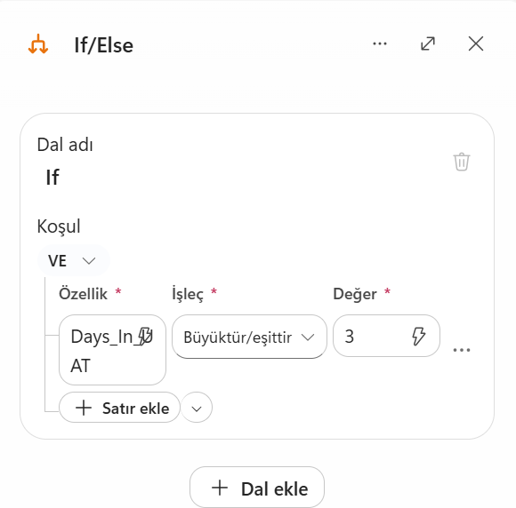
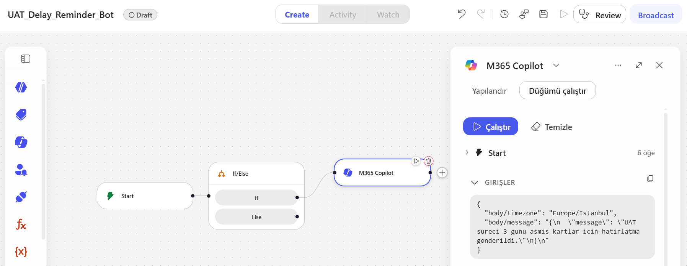

# Autonomous UAT Reminder Bot via Microsoft Copilot

## Overview
To eliminate workflow bottlenecks and prevent Sprint spillovers caused by forgotten UAT approvals, this automation monitors enterprise task boards. It autonomously identifies tasks stuck in the "In UAT" state for more than 3 days and dispatches direct notification alerts to the responsible business units.

## Workflow Schema & Architecture
The diagrams below illustrate the low-code schematic flow built via Microsoft Copilot Studio, detailing the trigger, conditional time-check, and automated M365 Copilot notification actions.

<table>
  <tr>
    <td align="center"><b>Execution & Configuration</b></td>
    <td align="center"><b><Core Architecture & Flow</b></td>
  </tr>
  <tr>
    <td></td>
    <td></td>
  </tr>
</table>

## Workflow Logic Steps
1. **Recurrence Trigger (`Start`):** Initiates the scheduled daily scan of active project states.
2. **Condition Gate (`If/Else`):** Evaluates whether the elapsed time in the UAT stage meets or exceeds the 3-day threshold.
3. **Action Dispatch (`M365 Copilot`):** Automatically routes targeted reminder alerts to the designated task owner, reducing manual follow-up toil.
   
